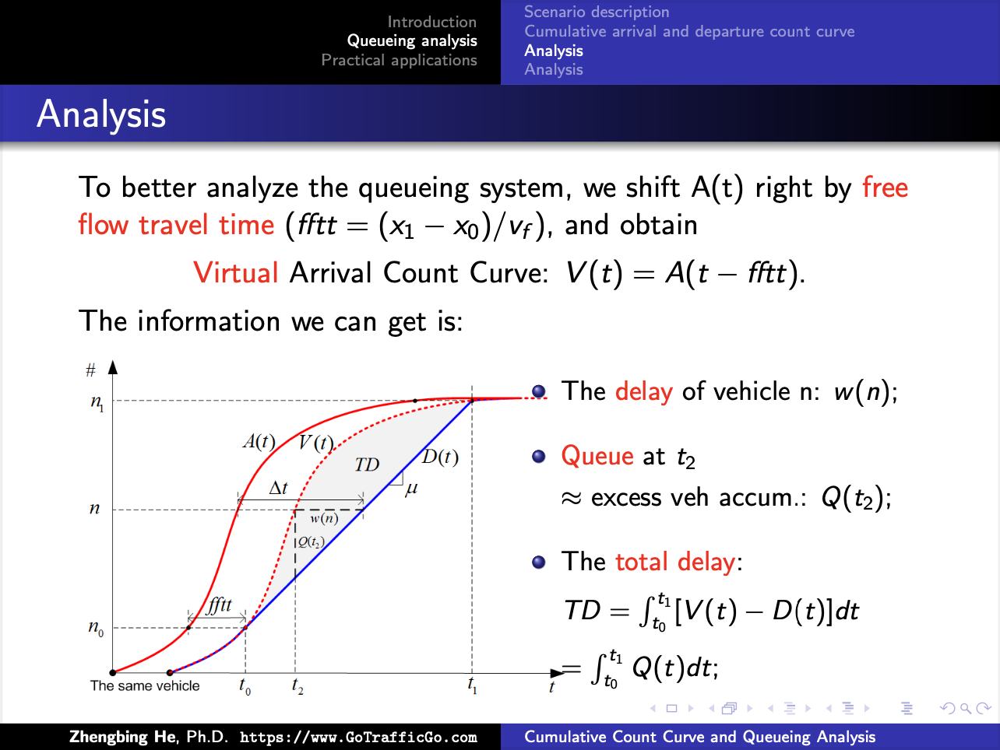
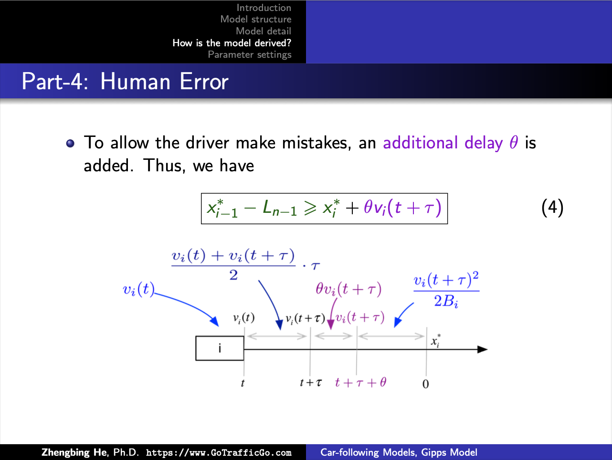
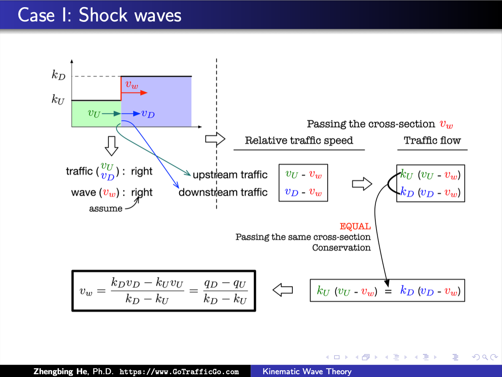
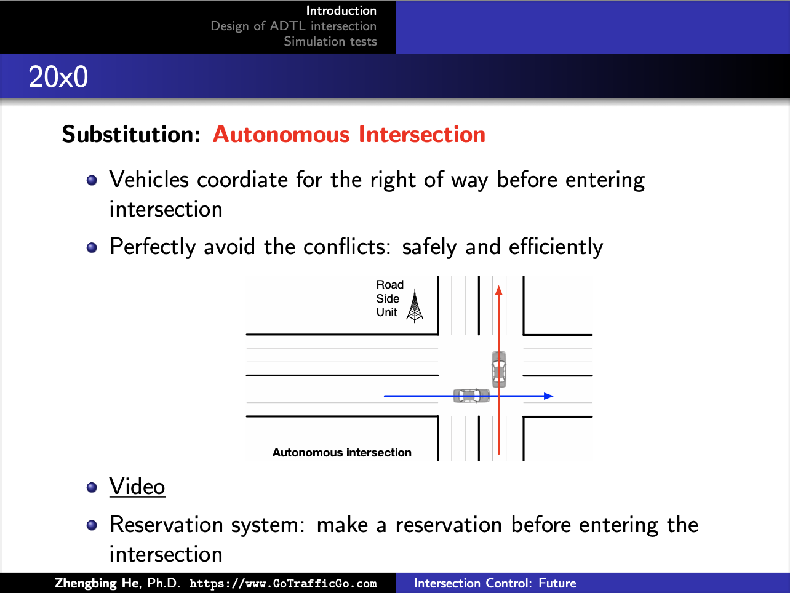
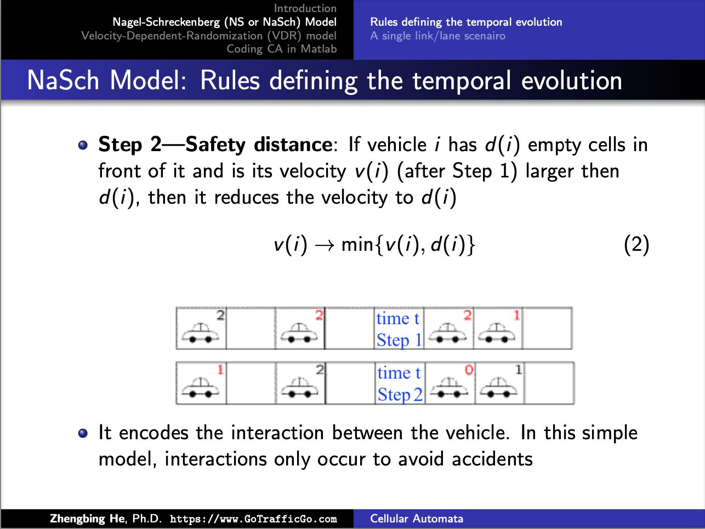
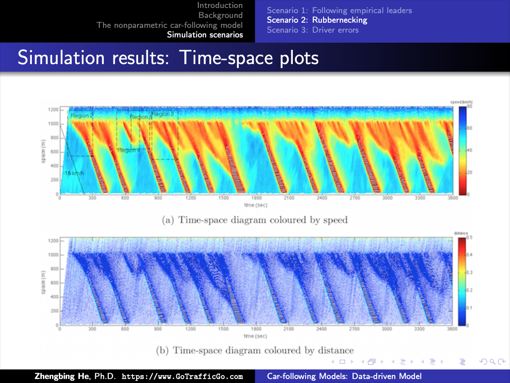

# brief intro

Traffic Flow Theory is a foundational course that focuses on traffic dynamics and the essential mathematical models and tools used to analyze and predict vehicle movement and traffic congestion on roadways. The course provides a solid understanding of key concepts such as vehicle trajectories, capacity drop, fundamental diagrams.
It particularly covers important models and tools, including car-following models, lane-changing models, kinetic wave theory, and cumulative count curves.
These concepts and tools form the foundation for various studies and applications in transportation engineering and traffic management.

